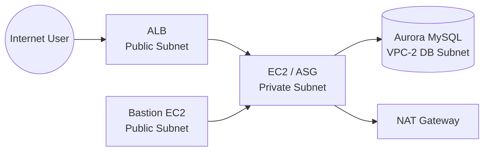

# InternationalPay 서비스 AWS 인프라 구축 문서

> **⚠️ Warning**
> - systemd, amazon-cloudwatch-agent 설정 시 **로그 그룹 이름** 반드시 확인
> - **리전: ap-northeast-2 (서울)** 고정
> - ALB 상태 검사 포트: **80**
> - 과제 지급 바이너리 **절대 수정 금지**
> - # 참고(준혁이형 벨로그): [velog.io/@zenru](https://velog.io/@zenru)
> - # [영상 링크](https://drive.google.com/file/d/1gUAJleYnJH1r5SzatV0CF80DMowT7DMt/view?usp=drive_link)

---

## 목차

- [1. 과제 개요](#1-과제-개요)
- [2. 전체 아키텍처](#2-전체-아키텍처)
- [3. 네트워크 및 보안](#3-네트워크-및-보안)
- [4. 컴퓨팅 구성](#4-컴퓨팅-구성)
- [5. 데이터베이스](#5-데이터베이스)
- [6. 개발 및 테스트](#6-개발-및-테스트)
- [7. 배포 및 확장](#7-배포-및-확장)
- [8. 로깅 및 모니터링](#8-로깅-및-모니터링)
- [9. 배포 체크리스트](#9-배포-체크리스트)
- [10. 주의사항](#10-주의사항)
- [11. 문서 요약 및 핵심 Takeaway](#11-문서-요약-및-핵심-takeaway)

---

### 구조도



## 전체 구축 순서 요약

```
① VPC 생성 (Application VPC + DB VPC, CIDR 겹치지 않게)
      ↓
② VPC Peering 생성 + 양방향 라우팅 추가
      ↓
③ KMS CMK 생성 (서비스별 각각 생성)
      ↓
④ Aurora(RDS) 생성 (서브넷 그룹 먼저, 생성 전 문제지와 비교 필수)
      ↓
⑤ Bastion EC2 생성 (퍼블릭, EIP, AdminFullAccess)
      ↓
⑥ Template EC2 구성
      → 보안 그룹 / 패키지 설치 / Python 실행 테스트
      → systemd 등록 / CloudWatch Logs 연동
      → 재시작 테스트 → AMI 생성
      ↓
⑦ 대상 그룹 + ALB 생성
      ↓
⑧ Launch Template + Auto Scaling Group 생성
      ↓
⑨ 최종 동작 확인
```

---

## 1. 과제 개요

### 1.1 과제 목표
**WorldPay** 유저 관리 시스템을 위한 AWS 인프라를 설계·구축한다.

핵심 목표:
1. **중요 정보 보호**
2. **고가용성 확보**
3. **확장성 확보**
4. **운영 자동화**

### 1.2 기술 스택
| 구분 | 기술 |
|---|---|
| 네트워크 | VPC, VPC Peering, NAT Gateway |
| 컴퓨팅 | EC2, ALB, ASG |
| 데이터베이스 | RDS Aurora MySQL |
| 보안 | Secrets Manager, KMS CMK |
| 모니터링 | CloudWatch Logs, CloudWatch Agent |
| 개발 언어 | Python 3.12 |
| OS | Amazon Linux 2023 |

### 1.3 기본 조건 및 제한사항
- **리전:** `ap-northeast-2 (서울)`
- **OS 이미지:** Amazon Linux 2023
- **변수값:** 문제에서 지정한 값은 **반드시 반영**
- **Bastion EC2**는 채점 시 사용하므로 연결과 권한 문제를 방지해야 한다.
- **지급된 바이너리 수정 금지**
- 명시되지 않은 리소스는 `ap-northeast-2`에 생성한다.

> **핵심:** 문서 기준은 "실행 가능성"이다. 설명이 아니라 **바로 구축할 수 있는 정보**를 남긴다.

---

## 2. 전체 아키텍처

### 2.1 아키텍처 요약
- 인프라는 **2개의 VPC**로 분리한다.
  - **VPC-1:** 애플리케이션용
  - **VPC-2:** 데이터베이스용
- 두 VPC는 **VPC Peering**으로 연결한다.
- 외부 사용자는 **ALB**를 통해 애플리케이션에 접근한다.
- 애플리케이션 서버는 **Private Subnet**에, DB는 별도 VPC의 Private 환경에 배치한다.

### 2.2 구조도
```
Internet User
     │ Port 80
     ▼
   [ ALB ]  ← Public Subnet (VPC-1)
     │ Port 8000
     ▼
[ EC2 / ASG ] ← Private Subnet (VPC-1)
     │ VPC Peering
     ▼
[ Aurora MySQL ] ← DB Subnet (VPC-2)

[ Bastion EC2 ] ← Public Subnet (VPC-1) → SSH → EC2
[ NAT Gateway ] ← Public Subnet (VPC-1) → 패키지 설치 경로
```

### 2.3 설계 원칙
- **외부 노출 최소화**
- **DB는 인터넷 비노출**
- **애플리케이션은 Private Subnet 배치**
- **멀티 AZ 기반 구성**
- **암호화 및 로그 수집 기본 적용**

> **주의:** 애플리케이션 서버가 Private Subnet에 있더라도, 패키지 설치와 외부 업데이트를 위해 **NAT Gateway**가 필요하다.

---

## 3. 네트워크 및 보안

### 3.1 VPC 생성
> **오탈자 주의**: VPC 이름, CIDR은 문제지와 정확히 일치해야 한다.
> **CIDR 겹침 주의**: VPC-1과 VPC-2의 CIDR 범위가 절대 겹치지 않아야 한다.

| VPC | 역할 | 서브넷 |
|---|---|---|
| VPC-1 | 애플리케이션 VPC | Public Subnet (2 AZ), Private Subnet (2 AZ) |
| VPC-2 | 데이터베이스 VPC | DB Subnet (2 AZ) |

### 3.2 서브넷 설계
- **Public Subnet:** ALB, Bastion EC2, NAT Gateway **퍼블릭 IPv4 주소 자동 할당**
- **Private Subnet:** Application EC2 (외부 통신은 NAT Gateway 경유)
- **DB Subnet:** Aurora MySQL (외부 인터넷 통신 차단)

### 3.3 NAT Gateway
Private Subnet 인스턴스에서 패키지 설치와 CloudWatch Agent 사용을 위해 반드시 필요하다.

| 항목 | 설정 |
|---|---|
| 위치 | Public Subnet |
| EIP | 연결 필요 |
| 대상 | Private Subnet의 기본 인터넷 경로 |

**Private Subnet 라우팅 테이블**

| Destination | Target |
|---|---|
| `0.0.0.0/0` | NAT Gateway |
| VPC-2 CIDR | VPC Peering |

> **경고:** NAT Gateway가 없으면 `dnf install`, `pip install`, CloudWatch Agent 적용이 막힌다.

### 3.4 VPC Peering

#### 피어링 연결 생성
```
VPC 서비스 → [피어링 연결] 탭 → [피어링 연결 생성]
→ VPC ID(요청자): VPC-1 선택
→ VPC ID(수락자): VPC-2 선택
→ [생성] 후 [수락] 클릭
```

#### 라우팅 테이블 양방향 추가 (필수!)
> **주의:** Peering만 만들고 라우팅을 추가하지 않으면 DB 통신이 되지 않는다.

| 라우팅 대상 | 목적지 | 타깃 |
|---|---|---|
| VPC-1 Private Route Table | VPC-2 CIDR | VPC Peering |
| VPC-2 DB Route Table | VPC-1 CIDR | VPC Peering |

### 3.5 보안 그룹 설계
| 대상 | 인바운드 포트 | 허용 소스 | 용도 |
|---|---|---|---|
| ALB-SG | 80 | `0.0.0.0/0` | 외부 트래픽 수신 |
| Bastion-SG | 22 | `0.0.0.0/0` | SSH 접속 |
| App-SG | 22, 8000 | ALB-SG / Bastion-SG | 앱 서버 접근 |
| DB-SG | 3306 | VPC-1 CIDR | Aurora 접근 |

### 3.6 KMS CMK (사용자 관리형 키)
> **핵심:** 암호화 대상 **서비스마다 각각 별도의 KMS 키**를 생성한다.

```
KMS 콘솔 → [키 생성] → 키 구성은 문제 요구사항대로
```

사용 예시:
- Aurora 저장 데이터 암호화
- 백업 및 스냅샷 암호화
- Secrets Manager 연동
- CloudWatch Logs 암호화

---

## 4. 컴퓨팅 구성

- 하기 전에 [5. 데이터베이스](#5-데이터베이스) 부터 하시길


### 4.1 Bastion EC2
- **Public Subnet**에 배치
- **EIP** 고정 할당 (IP 고정 필요 시)
- **IAM 권한:** `AdministratorAccess` (채점 시 사용)
- 관리용 SSH 진입점으로 사용

> **주의:** Bastion이 막히면 채점에 직접적인 문제가 생긴다. 연결 확인 필수.

### 4.2 Application EC2 (Template EC2)
- **Private Subnet**에 배치
- 필수 작업 순서:
  1. 보안 그룹 설정
  2. DNF 패키지 설치
  3. Python 패키지 설치
  4. main.py 실행 테스트 (**필수! 오류 없이 동작 확인 후 다음 단계**)
  5. systemd 서비스 등록
  6. CloudWatch Logs 연동
  7. 재시작 테스트
  8. AMI 생성

### 4.3 작업 위치와 경로
| 항목 | 경로 |
|---|---|
| 애플리케이션 소스 | `/home/ec2-user/main.py` |
| 로그 파일 | `/home/ec2-user/worldpay.log` |
| systemd 서비스 파일 | `/etc/systemd/system/worldpay.service` |
| CloudWatch 설정 파일 | `/opt/aws/amazon-cloudwatch-agent/etc/amazon-cloudwatch-agent.json` |

```bash
# 들어가기 전에 Allo Agent Fowarding & Pagent 키 추가 설정
# 기본 작업 위치 
cd /home/ec2-user
pwd
```

### 4.4 패키지 설치
```bash
# 시스템 패키지 (문제에서 요구하는 패키지 추가)
sudo dnf install -y python3.12 python3.12-pip mariadb1011

# Python 패키지
python3.12 -m pip install fastapi pydantic[email] pymysql boto3 sqlalchemy passlib

# ASGI 서버 (FastAPI 사용 시 필수)
python3.12 -m pip install uvicorn[standard]
```

### 4.5 main.py 작성
```bash
cd /home/ec2-user
vim main.py
```

### 4.6 Python 프로그램 실행 테스트 (AMI 생성 전 필수!)
```bash
python3.12 -m uvicorn main:app --host 0.0.0.0 --port 8000
```

**오류 발생 시 체크리스트**
- IAM 권한이 충분한지 확인
- Python 패키지에 문제가 없는지 확인
- 보안 그룹에 문제가 없는지 확인
- DB 접속 정보(Secrets Manager)가 올바른지 확인

### 4.7 systemd 서비스 파일 등록
```bash
sudo vim /etc/systemd/system/worldpay.service
```

```ini
[Unit]
Description=worldpay service
After=network.target

[Service]
User=ec2-user
WorkingDirectory=/home/ec2-user
ExecStart=/home/ec2-user/.local/bin/uvicorn main:app --host 0.0.0.0 --port 8000
StandardOutput=append:/home/ec2-user/worldpay.log
Restart=always

[Install]
WantedBy=multi-user.target
```

**systemd 주요 설정 설명**

| 항목 | 설명 |
|---|---|
| `Description` | 서비스 설명 |
| `After` | 이 서비스 실행 전 먼저 실행되어야 할 서비스 |
| `User` | 서비스를 실행할 유저 |
| `WorkingDirectory` | 서비스 실행 디렉토리 |
| `ExecStart` | 실행 명령어 |
| `StandardOutput` | 로그 출력 위치 |
| `Restart` | 오류 종료 시 재시작 여부 |

### 4.8 서비스 관리 명령어
```bash
sudo systemctl daemon-reload
sudo systemctl enable --now worldpay
sudo systemctl restart worldpay.service
sudo systemctl status worldpay.service
```

> **경고:** `ExecStart` 경로, 사용자 계정, `WorkingDirectory`가 틀리면 서비스가 정상 시작되지 않는다.

**재시작 테스트 (AMI 생성 전 반드시 수행)**
```bash
sudo reboot
# 재접속 후
sudo systemctl status worldpay
sudo systemctl status amazon-cloudwatch-agent
curl localhost:8000/health
```

### 4.9 IAM Role 권한
애플리케이션 EC2에 연결할 IAM Role에 필요한 권한:

| 서비스 | 권한 | 용도 |
|---|---|---|
| Secrets Manager | `GetSecretValue` | DB 비밀 정보 조회 |
| KMS | `Decrypt` | 암호화 키 사용 |
| CloudWatch Logs | `CreateLogStream`, `PutLogEvents` | 로그 전송 |
| CloudWatch Agent | `CloudWatchAgentServerPolicy` | 에이전트 동작 |

```json
{
  "Version": "2012-10-17",
  "Statement": [
    {
      "Sid": "SecretsManager",
      "Effect": "Allow",
      "Action": ["secretsmanager:GetSecretValue"],
      "Resource": ["arn:aws:secretsmanager:ap-northeast-2:[계정ID]:secret:[시크릿명]"]
    },
    {
      "Sid": "KMS",
      "Effect": "Allow",
      "Action": ["kms:Decrypt"],
      "Resource": ["arn:aws:kms:ap-northeast-2:[계정ID]:key/[키ID]"]
    },
    {
      "Sid": "CloudWatchLogs",
      "Effect": "Allow",
      "Action": ["logs:CreateLogStream","logs:PutLogEvents"],
      "Resource": ["arn:aws:logs:ap-northeast-2:[계정ID]:log-group:[클라우드 워치 로그 관리의 로그 그룹 이름]:*"]
    }
  ]
}
```

---

## 5. 데이터베이스

### 5.1 DB Subnet Group
```
RDS 콘솔 → [서브넷 그룹] → [서브넷 그룹 생성]
→ VPC-2 선택
→ AZ-a 서브넷 + AZ-b 서브넷 추가
```

> **순서 주의:** 데이터베이스 생성 전에 **서브넷 그룹을 먼저** 만들어야 한다.

### 5.2 Aurora MySQL 구성

```
RDS 콘솔 → [데이터베이스 생성]
→ 생성 버튼 클릭 전 문제지와 내 구성을 반드시 비교
```

| 항목 | 설정 |
|---|---|
| Engine | Aurora MySQL |
| 배치 | VPC-2 DB Subnet |
| 가용성 | Multi-AZ (Aurora 복제본 생성) |
| 보안 | 인터넷 접근 차단 |
| 암호화 | KMS CMK 적용 |
| 백업 | 자동 백업 활성화 |

> **헷갈리기 쉬운 용어:** PITR = Point-In-Time Recovery (역추적)
>
> **주의:** RDS 생성과 삭제는 많은 시간이 소요된다. 신중하게 설정 후 생성한다.

### 5.3 접근 규칙
- DB-SG는 **3306/TCP**만 허용
- 허용 소스는 **VPC-1 CIDR**로 제한
- 외부 인터넷 접근은 차단

### 5.4 접속 확인
```bash
nslookup worldpay-db.cluster-xxxxxxxx.ap-northeast-2.rds.amazonaws.com
mysql -h worldpay-db.cluster-xxxxxxxx.ap-northeast-2.rds.amazonaws.com -u admin -p
```

> **Tip:** DB 엔드포인트는 DNS 확인부터 해야 한다. 네트워크 문제인지, 계정 문제인지 먼저 분리해서 본다.

---

## 6. 개발 및 테스트

### 6.1 main.py 최소 구현 항목
- `/health` — ALB Target Group 헬스체크 경로
- `/health/db` — DB 연결 확인
- 사용자 관련 API

```python
@app.get("/health")
def health():
    return {"status": "ok"}
```

> **경고:** `/health`가 없으면 Target Group이 Unhealthy가 되어 ALB 서비스가 정상 동작하지 않는다.

### 6.2 의존성 관리
```bash
pipreqs ./ --force
pip3.12 install -r requirements.txt
```

### 6.3 로컬 실행 테스트
```bash
python3.12 -m uvicorn main:app --host 0.0.0.0 --port 8000
```

### 6.4 테스트 예시
```bash
curl localhost:8000/health
curl localhost:8000/users
curl -X POST localhost:8000/users \
  -H "Content-Type: application/json" \
  -d '{"email":"test@test.com","name":"hong","password":"pass1004"}'
```


# [아마존 에이전트 세팅은 여기 부터](8. 로깅 및 모니터링)


### 6.5 장애 발생 시 점검 순서
```bash
# 1. 헬스체크 직접 확인
curl localhost:8000/health

# 2. 서비스 상태 확인
sudo systemctl status worldpay

# 3. 실시간 로그 확인
sudo journalctl -u worldpay -f

# 4. DB DNS 확인
nslookup worldpay-db.cluster-xxxxxxxx.ap-northeast-2.rds.amazonaws.com

# 5. CloudWatch Agent 확인
sudo systemctl status amazon-cloudwatch-agent.service
```


**주요 디버깅 포인트**
- `main.py` 실행 에러
- DB 접속 실패 (Secrets Manager / 보안 그룹 / VPC Peering 라우팅)
- Security Group 누락
- systemd 서비스 경로 오류
- CloudWatch 로그 미전송
- NAT Gateway 누락으로 인한 패키지 설치 실패

  

---

## 7. 배포 및 확장

### 전체 배포 순서

```
① alb-sg 보안 그룹 생성 (포트 80, 소스 0.0.0.0/0)
      ↓
② App-SG 인바운드 규칙 추가 (포트 8000, 소스 alb-sg)
      ↓
③ 대상 그룹 생성 (포트 8000, /health)
      ↓
④ ALB 생성 (퍼블릭 서브넷 2개, alb-sg, 대상그룹 연결)
      ↓
⑤ AMI 생성 (Template EC2 기반)
      ↓
⑥ 시작 템플릿 생성 (AMI + 인스턴스유형 + App-SG + IAM Role)
      ↓
⑦ ASG 생성 (프라이빗 서브넷 2개, ALB 연결, Desired=2/Min=2/Max=4~6)
```

### 7.1 ALB

```
트래픽 흐름:
외부 트래픽 → Port 80 → ALB (alb-sg) → Port 8000 → Private EC2 (app-sg)
```

> **핵심 포인트:** ALB 자체는 **퍼블릭 서브넷**에 위치하지만, 트래픽은 **프라이빗 서브넷**의 EC2로 전달한다.

#### alb-sg 보안 그룹 생성
```
EC2 콘솔 → [보안 그룹] → [보안 그룹 생성]
```

| 항목 | 입력값 |
|---|---|
| 이름 | `alb-sg` |
| VPC | Application VPC |
| 인바운드: 유형 | HTTP |
| 인바운드: 포트 | 80 |
| 인바운드: 소스 | `0.0.0.0/0` |

#### App-SG 인바운드 규칙 추가
```
EC2 콘솔 → [보안 그룹] → App-SG → [인바운드 규칙 편집] → [규칙 추가]
```

| 유형 | 프로토콜 | 포트 | 소스 |
|---|---|---|---|
| 사용자 지정 TCP | TCP | 8000 | `alb-sg` |

### 7.2 Target Group 생성

```
EC2 콘솔 → [로드 밸런싱] → [대상 그룹] → [대상 그룹 생성]
```

**기본 구성**

| 항목 | 값 |
|---|---|
| Target Type | Instances |
| 이름 | `internalpay-tg` |
| Protocol | HTTP |
| Port | 8000 |
| VPC | Application VPC |

**상태 확인(Health Check)**

| 항목 | 값 |
|---|---|
| 프로토콜 | HTTP |
| 경로 | `/health` |
| 정상 임계값 | 2 |
| 비정상 임계값 | 3 |
| 제한 시간 | 5초 |
| 간격 | 30초 |

→ **[다음]** → 대상 등록 건너뜀 (ASG가 자동 등록) → **[대상 그룹 생성]**

### 7.3 ALB 생성

```
EC2 콘솔 → [로드 밸런서] → [로드 밸런서 생성] → [Application Load Balancer]
```

**기본 구성**

| 항목 | 입력값 |
|---|---|
| 이름 | `internalpay-alb` |
| 체계 | 인터넷 경계(Internet-facing) |
| IP 주소 유형 | IPv4 |

**네트워크 매핑**

```
VPC: Application VPC
가용 영역: 반드시 2개 선택
→ AZ-1: 퍼블릭 서브넷-A   ← ⚠️ ALB는 퍼블릭 서브넷!
→ AZ-2: 퍼블릭 서브넷-B
```

**보안 그룹 / 리스너**

| 항목 | 입력값 |
|---|---|
| 보안 그룹 | `alb-sg` (기본 보안 그룹 제거) |
| 리스너 프로토콜 | HTTP |
| 리스너 포트 | 80 |
| 기본 작업 | internalpay-tg로 전달 |

→ **[로드 밸런서 생성]** → `active` 상태 대기 (2~3분)

### 7.4 AMI 생성

> AMI = 현재 EC2 상태를 그대로 찍은 스냅샷 이미지. ASG가 이 이미지로 EC2를 자동 복제한다.

**생성 전 최종 체크리스트 (EC2 SSH 접속 후)**

```bash
# main.py 최신 상태 확인
cat /home/ec2-user/main.py | head -20

# worldpay 서비스 동작 확인
sudo systemctl status worldpay
# → Active: active (running) 이어야 함

# /health 응답 확인
curl http://localhost:8000/health
# → {"status": "ok"}

# CloudWatch Agent 동작 확인
sudo systemctl status amazon-cloudwatch-agent
# → Active: active (running) 이어야 함

# 로그 파일 권한 확인
ls -la /home/ec2-user/worldpay.log

# 불필요한 파일 정리
sudo rm -rf /tmp/*
history -c
```

**AMI 생성**

```
EC2 콘솔 → [인스턴스] → Template EC2 선택
→ [작업] → [이미지 및 템플릿] → [이미지 생성]
```

| 항목 | 입력값 |
|---|---|
| 이미지 이름 | `internalpay-ami-[날짜]` |
| 이미지 설명 | `InternationalPay 운영 이미지` |
| 재부팅 안 함 | **체크 해제** (재부팅해야 데이터 일관성 보장) |

```
[이미지] → [AMI] → 상태 "pending" → "available" 대기 (2~5분)
```

> ✅ **available** 상태 확인 후 다음 단계 진행

### 7.5 Launch Template 생성

```
EC2 콘솔 → [시작 템플릿] → [시작 템플릿 생성]
```

**기본 정보**

| 항목 | 입력값 |
|---|---|
| 이름 | `internalpay-lt` |
| 버전 설명 | `v1` |
| Auto Scaling 지침 | ✅ 체크 |

**세부 설정**

| 항목 | 입력값 |
|---|---|
| AMI | [내 AMI] 탭 → `internalpay-ami-[날짜]` |
| 인스턴스 유형 | 과제 지정 값 |
| 키 페어 | 기존 키 페어 선택 |
| 서브넷 | **시작 템플릿에 포함하지 않음** (ASG에서 지정) |
| 보안 그룹 | `App-SG` |
| IAM 인스턴스 프로파일 | Secrets Manager / KMS / CloudWatch 권한 포함 Role |

→ **[시작 템플릿 생성]**

> **IAM Role이 없는 경우**
> ```
> IAM 콘솔 → [역할] → [역할 생성] → EC2 선택
> 정책 추가:
>   - SecretsManagerReadWrite
>   - AWSKeyManagementServicePowerUser
>   - CloudWatchAgentServerPolicy
> 역할 이름: internalpay-ec2-role
> ```

### 7.6 Auto Scaling Group(ASG) 생성

```
EC2 콘솔 → [Auto Scaling 그룹] → [Auto Scaling 그룹 생성]
```

**1단계: 시작 템플릿**

| 항목 | 입력값 |
|---|---|
| 이름 | `internalpay-asg` |
| 시작 템플릿 | `internalpay-lt` |

**2단계: 인스턴스 시작 옵션**

```
VPC: Application VPC
서브넷:
→ 프라이빗 서브넷-A (AZ-1)   ← ⚠️ 반드시 프라이빗 서브넷!
→ 프라이빗 서브넷-B (AZ-2)
```

**3단계: 고급 옵션**

```
로드 밸런싱: [기존 로드 밸런서에 연결] → internalpay-tg 선택
상태 확인: [ELB] ✅ 활성화
모니터링: [CloudWatch 그룹 지표 수집 활성화] ✅ 체크
```

**4단계: 그룹 크기**

| 항목 | 값 |
|---|---|
| Desired Capacity | 2 |
| Minimum | 2 |
| Maximum | 4~6 (과제 명세에 따라) |

**크기 조정 정책**

```
[대상 추적 크기 조정 정책]
→ 지표 유형: 평균 CPU 사용률
→ 대상 값: 60
→ 인스턴스 워밍업: 300초
```

**6단계: 태그**

| 키 | 값 |
|---|---|
| Name | `internalpay-asg-instance` |
| Project | `InternationalPay` |

→ **[Auto Scaling 그룹 생성]**

---

## 8. 로깅 및 모니터링

### 8.1 CloudWatch 로그 그룹 생성

```
CloudWatch 콘솔 → [로그 그룹] → [로그 그룹 생성]
→ 이름: worldpay (문제 요구사항에 맞게)
```

### 8.2 CloudWatch Agent 설치

```bash
sudo dnf install amazon-cloudwatch-agent -y
```

### 8.3 설정 파일 작성

```bash
sudo vim /opt/aws/amazon-cloudwatch-agent/etc/amazon-cloudwatch-agent.json
```

```json
{
  "logs": {
    "logs_collected": {
      "files": {
        "collect_list": [
          {
            "file_path": "/home/ec2-user/worldpay.log",
            "log_group_name": "[로그 그룹 이름]",
            "log_stream_name": "{instance_id}",
            "timestamp_format": "%Y-%m-%d %H:%M:%S",
            "filters": [
              {
                "type": "exclude",
                "expression": ".*\\/health.*"
              }
            ]
          }
        ]
      }
    }
  }
}
```

> **주의:** `log_group_name`은 CloudWatch에서 생성한 로그 그룹 이름과 **정확히 일치**해야 한다.

### 8.4 CloudWatch Agent 서비스 적용 및 시작

```bash
sudo /opt/aws/amazon-cloudwatch-agent/bin/amazon-cloudwatch-agent-ctl \
  -a fetch-config \
  -m ec2 \
  -c file:/opt/aws/amazon-cloudwatch-agent/etc/amazon-cloudwatch-agent.json \
  -s
```

### 8.5 로그 확인

```bash
# 애플리케이션 로그
tail -f /home/ec2-user/worldpay.log

# systemd 로그
sudo journalctl -u worldpay -f

# CloudWatch Agent 상태
sudo systemctl status amazon-cloudwatch-agent.service
```

---

## 9. 배포 체크리스트

### 9.1 최종 동작 확인

**EC2 인스턴스 자동 생성 확인**
```
EC2 콘솔 → [인스턴스]
→ internalpay-asg-instance EC2가 2개 생성 확인
→ 상태: running / 상태 검사: 2/2 통과 대기 (3~5분)
```

**대상 그룹 Health Check 확인**
```
EC2 콘솔 → [대상 그룹] → internalpay-tg → [대상] 탭
→ 등록된 대상 2개가 모두 [정상] 상태 확인
   (초기 상태 → 잠시 후 정상으로 변경)
```

**ALB DNS 통신 확인**
```bash
# ALB DNS 이름 복사 후 테스트
curl http://internalpay-alb-[번호].[region].elb.amazonaws.com/health
# 예상 응답: {"status": "ok"}
```

### 9.2 필수 완료 항목
1. VPC 생성 (CIDR 겹침 없음)
2. VPC Peering 설정 (양방향 라우팅 포함)
3. NAT Gateway 생성 및 Private Route 연결
4. KMS CMK 생성 (서비스별 각각)
5. Aurora 생성 (서브넷 그룹 먼저, 암호화 적용)
6. Bastion EC2 생성 (EIP 할당, AdminFullAccess)
7. Template EC2 구성 (패키지 → 실행 테스트 → systemd → CloudWatch)
8. ALB / Target Group 생성
9. AMI 생성 (재시작 테스트 후)
10. Launch Template 생성
11. ASG 생성 (CloudWatch 그룹 지표 활성화)

### 9.3 정상 동작 확인 항목
- 리전이 **ap-northeast-2**인지 확인
- Name tag가 과제 요구와 일치하는지 확인
- Bastion 접근이 가능한지 확인
- DB 보안 그룹이 올바르게 연결되었는지 확인
- `/health` 응답이 정상인지 확인
- ALB Target 상태가 **Healthy**인지 확인
- CloudWatch Logs에 로그가 수신되는지 확인

---

## 10. 주의사항

> **주의:** 문제가 지정한 **변수 부분은 적절히 변경**해야 한다.

> **주의:** 과제에서 지급한 **바이너리는 절대 수정하지 않는다**.

> **주의:** `Bastion EC2`는 채점용 진입점이므로 연결 문제를 반드시 방지해야 한다.

> **주의:** `EC2 OS Image`는 **Amazon Linux 2023**을 사용한다.

> **주의:** 리소스는 명시가 없는 경우 **ap-northeast-2**에 생성한다.

> **주의:** Private Subnet에서 외부 설치가 필요하면 **NAT Gateway**를 먼저 확인한다.

> **주의:** VPC Peering 후 **양방향 라우팅 테이블** 추가를 잊지 않는다.

> **주의:** Python 실행 테스트 없이 AMI를 생성하면 ASG 인스턴스 전체가 장애 상태가 된다.

---

## 11. 문서 요약 및 핵심 Takeaway

### 11.1 문서 요약
- **VPC 2개 분리 구조**로 애플리케이션과 DB를 격리한다.
- **VPC Peering + 양방향 라우팅**으로 내부 통신만 허용한다.
- **NAT Gateway**로 Private Subnet의 외부 통신을 보장한다.
- **ALB + ASG**로 고가용성과 확장성을 확보한다.
- **Aurora MySQL + KMS**로 데이터 안정성과 보안을 강화한다.
- **systemd + CloudWatch**로 운영 자동화와 모니터링을 완성한다.

### 11.2 핵심 Takeaway
1. **보안**은 네트워크 분리와 최소 권한으로 완성한다.
2. **고가용성**은 Multi-AZ, ALB, ASG로 구현한다.
3. **운영 안정성**은 AMI 기반 롤링 배포와 CloudWatch로 확보한다.
4. **채점 안정성**은 Bastion, 리전, 태그, 바이너리 규칙 준수에 달려 있다.
5. **실전 완성도**는 "VPC Peering 라우팅, NAT, 헬스체크, 실행 테스트" 같은 작은 실수 방지에 달려 있다.

---

## 12. 참고 자료
- [velog.io/@zenru — AWS 1과제 예상 풀이](https://velog.io/@zenru)
- 업로드된 과제 요약 자료
- README.md
- 클라우드컴퓨팅 1과제 PDF
